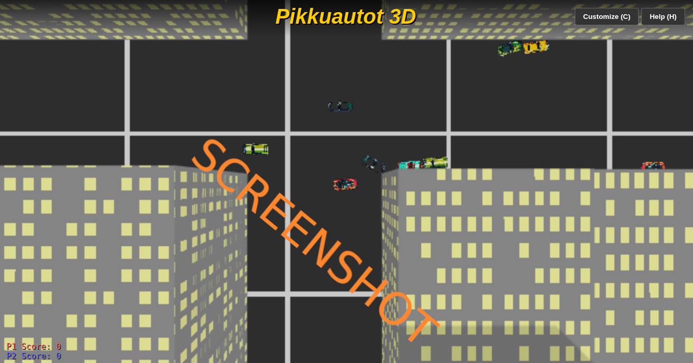

# js_pikkuautot_redux

# Pikkuautot 3D: City Edition

A **GTA 1–style top-down arcade driving game** built with **Three.js** and **Planck.js**.  
Drive north, dodge traffic, shoot enemies, and survive in an infinite highway or procedurally generated cities.

This project is fully browser-based, requires no build step, and runs entirely on the client.


## Play it now: https://pemmyz.github.io/js_pikkuautot_redux/

---

## Screenshots

### Game



## 🎮 Features

- 🚗 **GTA 1–inspired arcade driving physics**
- 🛣️ **Infinite highway mode** with chunk-based streaming
- 🏙️ **Procedurally generated city maps** (Small / Metropolis / Megacity)
- 👥 **2-player local co-op**
  - Keyboard (P1 + P2)
  - Gamepad support (press A/B/X/Y to join)
- 🤖 **Multiple AI personalities**
  - Cruiser (default)
  - Aggressive
  - Cautious
  - Erratic
  - Racer
- 🔫 **Twin-gun shooting**
- 💥 **Particle explosions**
- ⚙️ **Extensive customization menu**
  - Graphics quality
  - Physics performance
  - Camera settings
  - Traffic density
  - AI behavior
- 🌫️ Fog, shadows, headlights, and performance toggles

---

## 🕹️ Controls

### Player 1
- Move: **Arrow Keys**
- Shoot: **Ctrl**
- Handbrake: **Space**

### Player 2
- Move: **W A S D**
- Shoot: **F**
- Handbrake: **Shift**

### Gamepad
- Left stick: Steer
- A / D-Pad Up: Accelerate
- B / X: Shoot

---

## 🧠 AI System

Enemy cars use a modular AI system with swappable behaviors:

- **Cruiser** – Balanced, lane-following traffic
- **Aggressive** – Ramming, fast, hostile
- **Cautious** – Slow, avoids players
- **Erratic** – Weaving, unpredictable
- **Racer** – High-speed overtaking and apexing

AI decisions are tile-based and lane-aware, with automatic crash recovery.

---

## ⚙️ Tech Stack

- **Three.js (r160)** – Rendering
- **Planck.js** – 2D physics simulation
- **Vanilla JavaScript**
- **HTML5 Canvas**
- **Procedural textures** (no external assets required)

No bundler, no build step, no framework.

---

## 📁 Project Structure

```
/
├── index.html      # Main HTML entry
├── style.css       # UI & HUD styling
├── script.js       # Game logic, physics, AI, rendering
└── auto/           # Optional car sprite textures (001.png – 009.png)
```

If textures are missing, procedural placeholder cars are generated automatically.

---


## 🚀 Running the Game

```bash
# Clone or download your repo, then simply open index.html
# (No Node, bundlers, or servers required.)
```

If you prefer a local server (for strict browser policies):

```bash
# Python 3
python -m http.server 8000
# then open http://localhost:8000
```

---


## 🧪 Performance Tips

- Enable **Low Res** for weak GPUs
- Enable **Lite Physics** for slower CPUs
- Disable **Particles** and **Shadows** for maximum performance
- Use **Simple Materials** for faster rendering

Designed to scale from low-end laptops to gaming PCs.

---

## 🧱 Design Philosophy

- Arcade-first gameplay
- Deterministic, readable physics
- Minimal dependencies
- Mod-friendly structure
- Old-school feel with modern tech

Inspired by:
- GTA 1 & 2
- Micro Machines
- Death Rally
- Retro arcade racers

---

## 📜 License

MIT License – free to use, modify, and redistribute.

---

## 👤 Author

Created by **pemmyz**  
Built as an experimental retro-modern browser arcade project.

Enjoy the chaos 🚓💥
